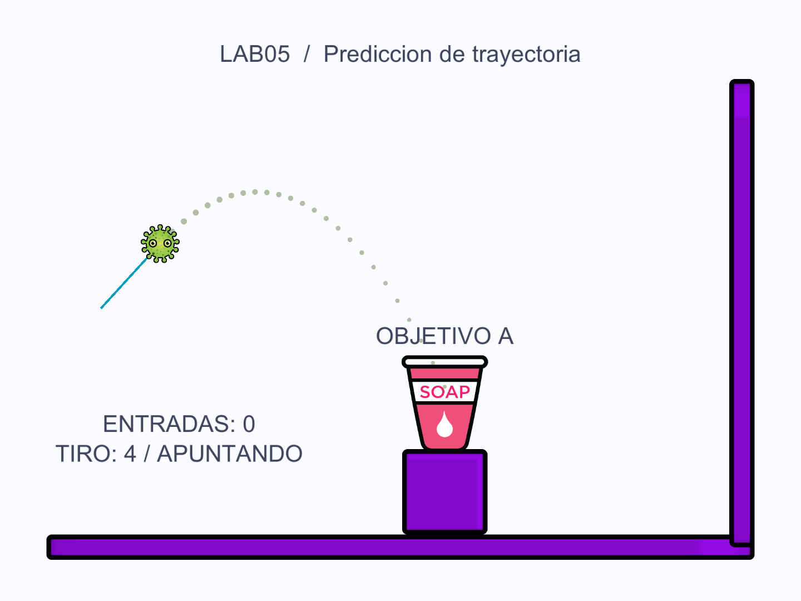
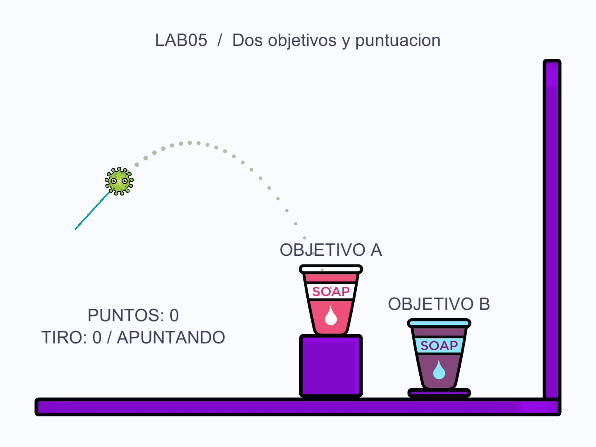
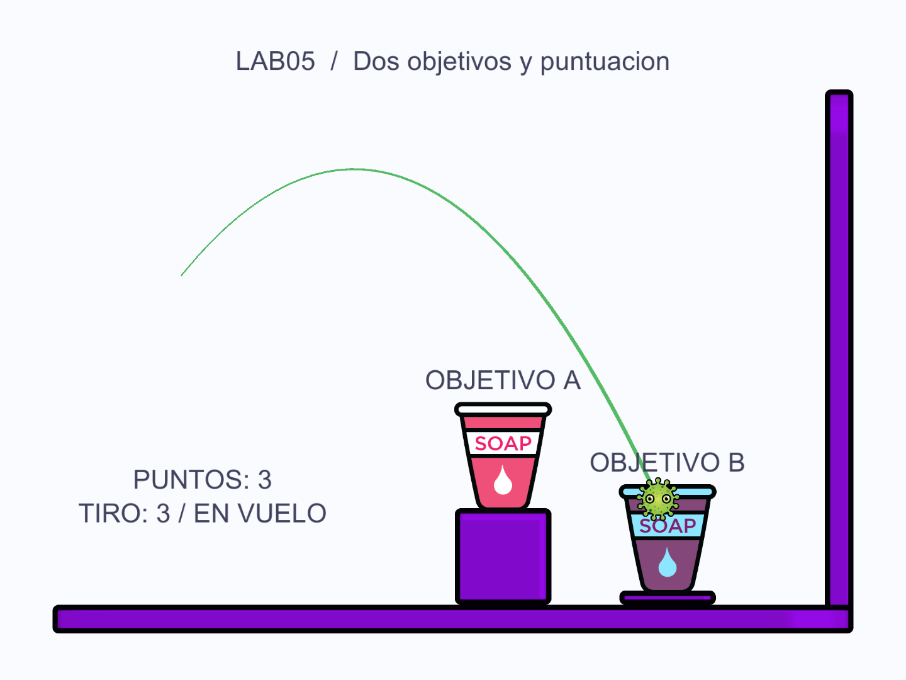

# Informe de laboratorio 05

## Predicción de trayectoria

## Ejercicio resuelto

### 1 Objetivo y fundamento

Implementar la predicción de la trayectoria de un proyectil y utilizarla como ayuda de apuntado antes del disparo. La escena base parte del repositorio indicado por la guía y conserva sus sprites y recursos [1, 2].

En vuelo libre, con aceleración constante y sin resistencia del aire, la posición se calcula como p(t) = p0 + v0 t + (g t²)/2. La velocidad inicial se obtiene del impulso J y la masa m: v0 = J/m cuando la bola parte del reposo. La gravedad utilizada es Physics2D.gravity multiplicada por gravityScale [1, 3, 4].

```csharp
Vector2 v0 = impulse / ball.rb.mass;
Vector2 g = Physics2D.gravity * ball.rb.gravityScale;
Vector2 p = origin + v0 * t + 0.5f * g * t * t;
```

La curva anticipa el vuelo previo al primer choque. Los rebotes dependen de los colliders y del material físico. Unity integra el movimiento en pasos discretos, por lo que la implementación incorpora una corrección por paso físico y utiliza damping cero.

### 2 Preparación del proyecto

Se descargó Tuto_DrawTrajectory, del autor hamza herbou, desde el repositorio indicado en la guía. Se utilizó el commit 9348e63d9d3c088568735257941fcc9d8751d309 y se conservaron los sprites de Ball, Cup, box y dot, junto con los recursos originales y la licencia MIT. El proyecto se completó con Packages y ProjectSettings para Unity 6000.3.15f1, la misma versión utilizada en los laboratorios anteriores [2].

| Proyecto o escena | Función |
| --- | --- |
| LAB05_PrediccionTrayectoria | Proyecto 2D con los recursos del repositorio base. |
| 01_Prediccion_Base.unity | Escena base con una taza y vista previa de la trayectoria. |
| Assets, Packages y ProjectSettings | Recursos, dependencias y configuración del proyecto Unity. |
| docs e evidencias | Documentación, instrucciones y capturas de ejecución. |

Para abrir el ejercicio, en Unity Hub se selecciona Add project from disk y la carpeta laboratorio 05/LAB05_PrediccionTrayectoria. Después se abre Assets/Scenes/01_Prediccion_Base.unity y se pulsa Play. La raíz dsj-labs no es un proyecto Unity.

El lanzamiento comienza con un clic sobre Ball. Se arrastra el ratón en sentido contrario al disparo y se suelta el botón izquierdo para aplicar el impulso. R recupera la bola y recoloca la taza. F12 guarda una captura de Game en Capturas. El proyecto utiliza Input Manager (Old).

### 3 Configuración de la escena 2D

| Objeto o parámetro | Configuración |
| --- | --- |
| Ball | Rigidbody2D; masa 1; gravityScale 1; damping lineal y angular 0; CircleCollider2D de radio local 0.645; escala 0.48. |
| Cup A | Rigidbody2D Dynamic; masa 1.5; damping lineal y angular 0.5; EdgeCollider2D con radio de borde 0.03; rotación bloqueada. |
| Muros y soportes | BoxCollider2D; suelo, muro derecho y soporte bajo la taza. |
| bounciness | Physics Material 2D asignado a Ball; fricción 0.5 y rebote 0.6, según la figura de la guía. |
| Gravedad y tiempo | Physics2D.gravity = (0, -9.81); fixedDeltaTime = 0.02 s. |
| Arrastre y puntos | pushForce 4; máximo arrastre 3 unidades; 45 puntos separados 0.05 s. |

La escena contiene los sprites Ball, Cup y los muros del repositorio base. Ball utiliza Rigidbody2D y CircleCollider2D; Cup utiliza Rigidbody2D y un EdgeCollider2D abierto por arriba, con forma de U. Los muros utilizan BoxCollider2D. Se crea el material bounciness con fricción 0.5 y rebote 0.6 y se asigna a Ball. La detección continua ayuda a evitar que la bola atraviese los bordes y la interpolación suaviza su representación.

### 4 Integración y ejecución

Se añade Ball.cs a la bola y se crea el objeto GameManager. Se enlazan las referencias de Ball y Trajectory y se establece pushForce en 4. GameManager coordina el arrastre, Trajectory coloca los puntos previstos y Ball activa su Rigidbody2D al soltar el botón para aplicar el impulso.

Antes del disparo la bola permanece inmóvil y los puntos muestran el arco. Durante el vuelo, Rigidbody2D resuelve la gravedad y los contactos. El material físico produce el rebote al tocar los muros. La vista previa termina ante el primer obstáculo; no calcula rebotes posteriores ni el movimiento futuro de la taza.



Figura 1. Predicción hacia la taza de la escena base. Render real de la cámara de Unity durante una prueba automatizada.

### 5 Verificación del ejercicio base

Se verificaron cuatro vuelos libres de 0.8 s con masas 1 y 2 y gravityScale 1 y 0.6. Las posiciones del Rigidbody2D se compararon en pasos completos de 0.02 s. El error máximo fue de 0.0000029 unidades con corrección y de 0.0784798 unidades con la ecuación continua sin corrección.

En el rebote contra el suelo se midió una relación de velocidades de 0.61755, próxima al valor configurado de 0.6. La gravedad y el muestreo discreto explican que esa medición no sea idéntica al coeficiente del material. La precisión de la vista previa se midió solo antes del primer contacto.

Las capturas del informe son renders reales de la cámara de Unity durante pruebas automatizadas. Las pruebas reproducen el arrastre mediante los mismos métodos de GameManager; las imágenes no incluyen las ventanas Inspector y Console.

## Ejercicios propuestos

### 1 Explique el funcionamiento de los métodos de la estructura de clases del videojuego.

El flujo conserva la estructura Ball, GameManager y Trajectory de la guía. GameManager interpreta el arrastre y calcula el impulso; Trajectory muestra las posiciones previstas; Ball activa el cuerpo físico y aplica el lanzamiento. Cup y CupSensor añaden la gestión de los objetivos. Los métodos siguientes corresponden al código entregado.

| Método de Ball | Funcionamiento |
| --- | --- |
| Awake | Obtiene Rigidbody2D y CircleCollider2D, y guarda la posición inicial. |
| Push(Vector2 force) | Incrementa ShotId, registra origen y velocidad inicial, activa InFlight y aplica AddForce con ForceMode2D.Impulse. |
| ActivateRb | Cambia bodyType a Dynamic y despierta el cuerpo físico. |
| DesactivateRb | Pone velocidades a cero, cambia a Kinematic y termina InFlight. Conserva la denominación de la guía. |
| ResetBall | Desactiva la física, recupera la posición inicial y la rotación cero, y limpia la estela sin dibujar el salto de recuperación. |
| OnCollisionEnter2D | Cuenta los contactos físicos para la verificación del vuelo y los rebotes. |

| Método de GameManager | Funcionamiento |
| --- | --- |
| Awake y Start | Establecen la instancia, la cámara y el estado inicial de la bola y la línea de arrastre. |
| Update | Lee ratón y teclado, comprueba que el clic inicial esté sobre Ball y coordina el arrastre. |
| OnDragStart | Guarda el punto inicial del ratón y muestra la trayectoria con la bola inmóvil. |
| OnDrag | Limita startPoint - point a maxDragDistance, calcula CurrentImpulse y actualiza los puntos. |
| OnDragEnd | Oculta la vista previa y dispara si el impulso no es demasiado pequeño. |
| PushBall | Activa Ball como Dynamic y llama a Push con el impulso calculado. |
| RegisterHit | Registra una llegada por combinación de tiro y taza; actualiza Hits, Score y el historial. |
| ResetShot y ClearScore | Recuperan bola y tazas; el segundo método limpia puntos e historial. |
| RefreshWorldHud | Actualiza los textos de estado, tiro y puntos dentro de la escena, visibles también en los renders de cámara. |
| OnGUI | Muestra título, marcador, último evento y controles. |

| Método de Trajectory | Funcionamiento |
| --- | --- |
| Start y PrepareDots | Crean una sola vez los puntos a partir del prefab y reducen progresivamente su escala. |
| PositionAtTime | Evalúa la ecuación continua p0 + v0 t + 0.5 g t² de la guía. |
| PhysicsPositionAtTime | Añade 0.5 g fixedDeltaTime t para aproximar la integración física discreta. |
| UpdateDots | Convierte impulso en velocidad mediante la masa, usa gravityScale y posiciona cada punto; CircleCast limita la vista previa al primer obstáculo. |
| Show y Hide | Activan o desactivan el objeto padre Dots. |

Para pasos completos de duración Δt, la integración que actualiza primero la velocidad y luego la posición suma g Δt² n(n+1)/2. Por ello, la vista previa usa la ecuación continua más 0.5 g Δt t. Esta corrección se verificó contra el movimiento real de Rigidbody2D antes de las colisiones. No incorpora damping, fuerzas posteriores ni rebotes; los parámetros de Ball se fijaron con damping cero.

| Método de los objetivos | Funcionamiento |
| --- | --- |
| Cup.Awake | Obtiene el Rigidbody2D y guarda la posición y rotación iniciales de la taza. |
| Cup.ResetCup | Pone velocidades a cero, restaura posición y rotación guardadas y despierta el cuerpo. |
| Cup.Hit | Delega el registro de la llegada al GameManager. |
| CupSensor<br>OnTriggerEnter2D | Filtra los colliders que pertenecen a Ball y comunica la entrada al objetivo. |

### 2 Agregue otro sprite cup como objetivo de disparo.

Se duplica la taza de la escena base para crear Cup B en Assets/Scenes/02_Dos_Objetivos_Puntuacion.unity. Se conservan el sprite, Rigidbody2D Dynamic, masa 1.5, damping 0.5 y EdgeCollider2D con radio de borde 0.03. La rotación se bloquea para mantener estable la boca de la taza. El color y el identificador permiten distinguir A de B.

Cup B se coloca al otro lado de la escena, al alcance de la bola. Se abre 02_Dos_Objetivos_Puntuacion.unity y se pulsa Play. Las teclas 1 y 2 alternan entre esta ampliación y la escena base.



Figura 2. Segunda escena con tazas A y B. El arrastre muestra el arco hacia A y el marcador inicia en cero.

### 3 Agregue el conteo de puntuación cada vez que dé en el objetivo.

Cada taza concede un punto cuando Ball entra en un BoxCollider2D interior marcado como trigger durante un tiro. El contacto con la pared exterior de la taza no cuenta como una entrada exitosa.

CupSensor.OnTriggerEnter2D comprueba si el collider pertenece a Ball y llama a Cup.Hit. Este método comunica el evento a GameManager.RegisterHit. Un HashSet guarda la clave ShotId:targetId y evita sumar varias veces por permanencia, rebote o reentrada en la misma taza durante el mismo disparo. Un tiro nuevo permite volver a puntuar; si llega a ambas tazas, cada objetivo puede registrar su propio punto.

```csharp
string key = projectile.ShotId + ":" + cup.targetId;
if (!scoredShots.Add(key)) return false;
Hits++;
if (scoreEnabled) Score += cup.points;
```



Figura 3. Resultado del tercer tiro de la prueba A, A y B. La entrada al objetivo B deja el marcador real en tres puntos. La línea verde muestra el vuelo observado.

R recupera la bola y recoloca las tazas conservando los puntos. N inicia una partida con puntuación cero y limpia el historial. El marcador y el último objetivo alcanzado se actualizan dentro de la escena.

### Verificación de la escena y los ejercicios 1 a 3

Se compiló el proyecto 2D y se ejecutó su verificación en el reproductor de Unity con Physics2D.Simulate a pasos de 0.02 s. Se emplearon cuerpos y colliders reales; las pruebas de apuntado invocaron los mismos métodos de arrastre de GameManager con una entrada reproducible. Las imágenes 2D son renders de la cámara con textos de estado y puntos pertenecientes a la escena. No muestran Inspector, Console ni una sesión manual de ratón.

| Comprobación | Resultado observado |
| --- | --- |
| Configuración 2D y ecuaciones | 29 comprobaciones correctas y 0 errores. Referencias, masa, colliders, material y muros visibles alineados con su collider. |
| Física y puntuación 2D | 34 comprobaciones correctas y 0 errores. Lanzamiento, recuperación, puntuación y rebote. |
| Cuatro vuelos libres de 0.8 s | Masas 1 y 2; gravityScale 1 y 0.6. Error máximo con corrección: 0.0000029 unidades; sin corrección: 0.0784798 unidades. |
| Puntuación A, A y B | Tres tiros sucesivos dejaron Score en 1, 2 y 3. El intento de duplicado del mismo tiro no sumó. R conservó puntos y N los borró. |
| Rebote contra el suelo | Relación de velocidades medida 0.61755, próxima al rebote configurado de 0.6. |

La precisión se midió únicamente en los cuatro vuelos libres anteriores al primer contacto. Los valores cero de las columnas de error en las filas de impactos del CSV significan que allí no se midió precisión. La relación de rebote observada tampoco es una igualdad exacta con el coeficiente del material, porque se obtiene a partir de velocidades discretas afectadas por la gravedad.

Las comprobaciones conjuntas de la escena base y la ampliación dieron 29 verificaciones correctas en Editor y 34 en el reproductor, sin errores. El proyecto 2D produjo una build Windows. Las fuentes de resultados son evidencias/2d/resultado-editor-2d.txt, resultado-runtime-2d.txt, resultados-runtime-2d.csv y eventos-impactos-2d.txt.

Las pruebas se pueden repetir con tools/Verificar-2D.ps1. El script regenera las escenas; antes de ejecutarlo se deben conservar las personalizaciones en otra escena.

**4 Desarrolle el tutorial de [Calculating Trajectories de Unity Learn](https://learn.unity.com/tutorial/calculating-trajectories)**


**5 Haga un informe de la solución de los ejercicios planteados.**


## Cuestionario

**1 ¿Cómo funciona el procedimiento de trayectoria de un proyectil?**


**2 ¿Qué elementos proporciona Unity para apoyar la implementación de la trayectoria de proyectiles en videojuegos?**


## Referencias y bibliografía

[1] Sulla Torres, J., y Limache, R. Sesión 5 Predicción de Trayectoria. Guía de laboratorio de Desarrollo de Software para Juegos, UNSA, 2026B. Archivo facilitado por la docente.

[2] herbou. Tuto_DrawTrajectory. Código y sprites del proyecto base, licencia MIT. Commit 9348e63d9d3c088568735257941fcc9d8751d309. [Repositorio base](https://github.com/herbou/Tuto_DrawTrajectory/tree/9348e63d9d3c088568735257941fcc9d8751d309)

[3] Unity Technologies. Rigidbody2D. Scripting API de Unity 6.3. [Rigidbody2D](https://docs.unity3d.com/6000.3/Documentation/ScriptReference/Rigidbody2D.html)

[4] Unity Technologies. Rigidbody2D.AddForce. Scripting API de Unity 6.3. [AddForce](https://docs.unity3d.com/6000.3/Documentation/ScriptReference/Rigidbody2D.AddForce.html)

[5] Unity Technologies. PhysicsMaterial2D. Scripting API de Unity 6.3. [PhysicsMaterial2D](https://docs.unity3d.com/6000.3/Documentation/ScriptReference/PhysicsMaterial2D.html)
