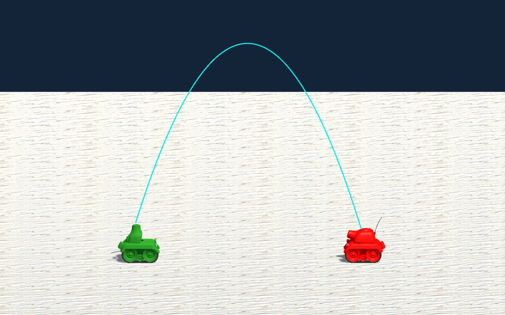
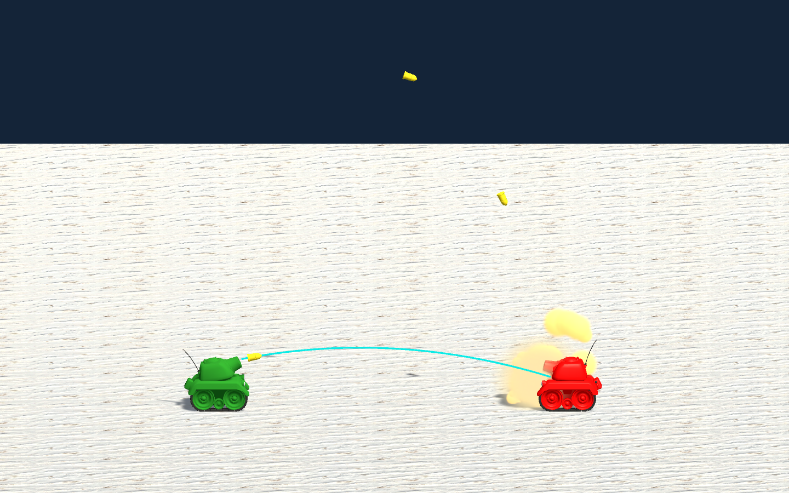

# Ejercicio V.4 — Calculating Trajectories

## Resultado y alcance

Se completó el tutorial solicitado en la guía con un proyecto independiente de **Unity 6000.3.15f1**: `laboratorio 05/Calculating Trajectories`. La escena principal es `Assets/Tanks.unity`. El tanque verde calcula el ángulo de su cañón y dispara automáticamente contra el tanque rojo, que se puede mover con el teclado. Una línea turquesa representa la trayectoria predicha; los proyectiles recorren esa trayectoria mediante el motor físico de Unity.

Este apartado usa **Rigidbody 3D**, tal como el recurso oficial de Unity Learn. El ejercicio principal de predicción de trayectoria de la práctica usa **Rigidbody2D** y se documenta por separado.

## Fuente y autoría

La URL extensa de la guía redirige al tutorial [Calculating Trajectories — Unity Learn](https://learn.unity.com/tutorial/calculating-trajectories), perteneciente al curso [The Physics of AI](https://learn.unity.com/project/the-physics-of-ai), de Penny de Byl. El tutorial aborda movimiento parabólico, cálculo del punto de impacto y un tanque que usa la física de Unity para disparar y seguir al enemigo.

Se descargó el paquete **oficial**, no una recreación sin fuente:

- [S0311Resources.zip](https://unity-connect-prd.storage.googleapis.com/20220915/bfcaabbf-7afb-4769-ac48-28f4d66732ae/S0311Resources.zip), enlazado en Resources del tutorial.
- Copia sin modificar: `Calculating Trajectories/SourcePackages/S0311Resources.zip`.
- Descarga y consulta: 9 de octubre de 2026.
- SHA-256: `3688C100515487FC20E315D05D81973A76DE18FC6098161DB0D62ADD515DB40B`.
- Contenido del ZIP: `S0311Resources/S0311.unitypackage`.

Los modelos, materiales, prefabs, escenas y scripts originales corresponden al material educativo de Unity Learn/Unity Technologies. Las adaptaciones del laboratorio se identifican en los scripts y en esta memoria. Se conserva el ZIP para contrastar la versión original. El paquete descargado no incorpora un archivo de licencia separado; no se atribuye una licencia nueva al material original.

## Preparación del proyecto

1. Se extrajeron los assets y sus `.meta` del paquete oficial, preservando los GUID y las referencias entre escenas, scripts y prefabs.
2. Se creó la estructura `Assets`, `Packages` y `ProjectSettings`, igual a la utilizada en el laboratorio 02 del repositorio.
3. Se fijó la versión del editor en `ProjectSettings/ProjectVersion.txt`.
4. Se configuró `Assets/Tanks.unity` como escena de inicio de la build. También se conservaron `Assets/bullet.unity` y `Assets/Scenes/SampleScene.unity` del paquete como recursos originales.
5. Se añadió el tag `tank`, que el paquete presupone pero que un proyecto nuevo no contiene.
6. Se ajustó la cámara para mostrar ambos tanques y la parábola completa. Se añadió un HUD con el arco seleccionado, ángulo, rapidez, disparos e impactos.
7. Se compiló el ejecutable de Windows en `Calculating Trajectories/Builds/Windows/Calculating Trajectories.exe`.

## Modelo matemático aplicado

Con aceleración constante y sin resistencia del aire, la posición se predice mediante:

\[
\mathbf p(t)=\mathbf p_0+\mathbf v_0t+\tfrac12\mathbf gt^2
\]

Para un objetivo a distancia horizontal \(x\), desnivel \(y\), rapidez de lanzamiento \(v\) y magnitud vertical de gravedad \(g\), las dos elevaciones posibles cumplen:

\[
\theta=\arctan\left(\frac{v^2\pm\sqrt{v^4-g(gx^2+2yv^2)}}{gx}\right)
\]

El signo positivo da el arco alto y el negativo el arco bajo. El discriminante negativo significa que el blanco no es alcanzable con esa rapidez: la IA se aproxima y vuelve a calcular. Los casos de distancia horizontal nula o parámetros físicos no válidos se descartan antes de dividir.

La solución usa **15 m/s**, la gravedad del proyecto **(0, −9.81, 0) m/s²**, damping lineal cero y un cuerpo dinámico con gravedad activa. En lugar de mover el proyectil manualmente cada frame, `FireShell` asigna una única velocidad inicial a `Rigidbody.linearVelocity`; después PhysX lo integra. La [API oficial de Unity 6](https://docs.unity3d.com/6000.0/Documentation/ScriptReference/Rigidbody-linearVelocity.html) define esta propiedad como velocidad en coordenadas del mundo.

La predicción termina en el centro del collider del objetivo. Como la boca del cañón se desplaza al rotar la torreta, se recalculan el origen y el ángulo durante 12 iteraciones. Esto sustituye la aproximación fija de un metro del script original.

## Scripts y relación con la escena

| Archivo | Función |
|---|---|
| `Assets/Scripts/FireShell.cs` | Calcula ambas soluciones, orienta el tanque y la torreta, persigue al objetivo fuera de alcance y crea proyectiles físicos. |
| `Assets/Scripts/AIShell.cs` | Orienta el proyectil según su velocidad, procesa la colisión y cuenta los impactos reales en el objetivo. |
| `Assets/Scripts/Drive.cs` | Control original del tanque rojo con los ejes Horizontal y Vertical. |
| `Assets/Scripts/DestroyShell.cs` | Destruye proyectiles restantes después de 8 segundos. |
| `Assets/Scripts/TutorialPresentation.cs` | Dibuja la predicción con `LineRenderer`, presenta los datos y permite reiniciar. |
| `Assets/Editor/TutorialBuild.cs` | Prepara la escena y produce la build de Windows. No forma parte del comportamiento del ejecutable. |
| `Assets/Editor/TutorialVerification.cs` | Comprueba cálculos y comportamiento en Play Mode; exporta resultados y capturas reales de cámara. |

Los scripts `Shell.cs` y `MoveShell.cs` del paquete también se conservaron para los ejemplos originales, pero el tiro de la IA utiliza `AIShell` con Rigidbody.

## Adaptaciones realizadas sobre el paquete

- API de Unity 6: `Rigidbody.velocity` se actualizó a `Rigidbody.linearVelocity` en los scripts de tiro de la IA.
- Se lee la gravedad real del proyecto en lugar de mantener `9.8` como constante independiente.
- Se calcula desde la boca real del cañón hasta el centro del collider del blanco. Se eliminó la corrección fija `distancia − 1` del original.
- Se corrigió la persecución: en el recurso original, el tanque también avanza cuando está esperando el siguiente disparo. Aquí avanza únicamente si el blanco es inalcanzable.
- Se añadió un margen de alineación horizontal de 2° antes de disparar.
- Se mantuvo el principio del disparo automático y se ajustó el intervalo de 0.2 a 0.8 segundos para distinguir los proyectiles durante la demostración.
- Se ignora la colisión con el collider del tanque emisor y se usa detección continua en los proyectiles.
- La vida máxima del proyectil pasó de 3 a 8 segundos para que el arco alto no expire antes de llegar cuando se cambien las condiciones.
- Los impactos se registran por referencia al objetivo. El suelo se dejó como `Untagged`, evitando confundir impactos contra el terreno con aciertos contra el tanque.
- Se añadieron el selector de arco, la línea de predicción, el HUD, el reinicio, las pruebas y la configuración de cámara.

## Uso

Abrir esta carpeta con Unity Hub y seleccionar **6000.3.15f1**. Abrir `Assets/Tanks.unity` y pulsar Play, o ejecutar la build de Windows indicada arriba.

| Tecla | Acción |
|---|---|
| W/S o ↑/↓ | Avanzar y retroceder con el tanque objetivo. |
| A/D o ←/→ | Girar el tanque objetivo. |
| L | Alternar arco alto y bajo. |
| R | Reiniciar la escena. |

El tanque verde funciona automáticamente. El control `Drive` original también conserva T/G para girar el cañón del objetivo y B para crear su proyectil manual; estos controles accesorios no intervienen en la verificación de tiro de la IA.

## Verificación ejecutada

Se realizó la build de Windows con resultado `Succeeded`, sin errores de compilación. Luego se ejecutó una prueba real en **Play Mode durante 9.3 segundos**, utilizando la escena principal y PhysX:

| Comprobación | Resultado |
|---|---|
| Dos raíces de tiro para un blanco al mismo nivel | Correctas; arco bajo < arco alto y suma de 90°. |
| Blanco a 100 m con rapidez de 15 m/s | Rechazado por discriminante negativo. |
| Errores registrados durante Play Mode | **0**. |
| Disparos generados antes del caso inalcanzable | **10**. |
| Impactos físicos de proyectiles de arco alto | **6**. |
| Impactos físicos de proyectiles de arco bajo | **3**. |
| Desplazamiento durante recarga con blanco alcanzable | **0 m**. |
| Persecución después de alejar el blanco 100 m | **0.798 m** en la ventana final. |
| Disparos nuevos mientras el blanco es inalcanzable | **0**. |
| Resultado global | **passed: true**. |

Los impactos de cada arco se clasifican al crear el proyectil; los proyectiles altos que aún estén volando no se contabilizan erróneamente como tiros bajos al pulsar L.

Se abrió además la build de Windows durante **8 segundos**: permaneció ejecutándose, registró **3 impactos** contra el objetivo y no presentó excepciones del proyecto. La observación se finalizó de forma controlada.

Los resultados verificables se guardan en `pruebas/tutorial/resultados.json`, `pruebas/tutorial/player.json` y `pruebas/tutorial/verificacion.txt`.

## Evidencias de Unity

Estas imágenes son **renders de la cámara de Unity obtenidos durante Play Mode**, no mockups ni capturas inventadas del editor. Muestran los modelos y materiales oficiales junto con la predicción añadida. El HUD de `OnGUI` se muestra al ejecutar el proyecto, pero no entra en un render explícito de `Camera.Render`.

**Figura 1.** El cañón se eleva y la línea turquesa dibuja la solución alta entre el tanque verde y el blanco rojo.

**Figura 2.** Tras alternar el tipo de solución, el tanque usa un ángulo menor para alcanzar el mismo objetivo.

## Límites del ejercicio

El cálculo supone gravedad vertical constante y ausencia de damping lineal. Apunta a la posición actual del tanque objetivo: no calcula la intercepción de un objetivo que continúe moviéndose durante el tiempo de vuelo. Por eso un blanco rápido puede esquivar el proyectil. La línea tampoco simula obstáculos intermedios ni rebotes. PhysX integra con pasos discretos, por lo que puede haber una diferencia pequeña respecto a la curva analítica; la validación de aciertos usa colisiones reales, no la línea dibujada.
